# Garmin Device Connect IQ IoT App
**produced by Dave Lusty**

## Introduction
This guide details how to configure the IoT watch app with Azure Services.
You can find videos of this demo on Youtube at the following locations:
[Part 1 - Intro](https://youtu.be/_39eKRNK3UU)
[Part 2 - Initial Platform Build](https://youtu.be/9llyGjfKiLo)

You can also find instructions on adding machine learning to the solution at [Watch Demo HR check with machine learning](https://github.com/davedoesdemos/ConnectIQ-Watch-IoT/blob/master/MLModelTraining.md)

## Prerequisites

Before getting started with this app you'll need to have a few things. Firstly you'll need a compatible (Garmin device)[https://developer.garmin.com/connect-iq/compatible-devices/]. Different devices have different capabilities so not all of them will be able to send all metrics.

Next, you'll need the Connect IQ SDK, the Eclipse IDE and the Java JRE installed. Instructions for setting these up can be found in the (Garmin getting started guide)[https://developer.garmin.com/connect-iq/programmers-guide/getting-started/].

# Environment 1


Of the two methods shown here, environment 1 is the simplest. This architecture uses a Logic App with HTTP endpoint to ingest data and push this to the Power BI streaming data service. This is simple to configure but not as scalable as the Event Hub version below.

## Power BI

Log in to [Powerbi.microsoft.com](https://powerbi.microsoft.com/en-us/) and create a new app workspace called ConnectIQ Demo. Once created, add a streaming dataset. Choose API and click Next.


Add in the various fields we'll be collecting. All of these are numbers except the timestamp which will be datetime. Enable historical data analysis so we can use the data later as well as in real time.


Now create a dashboard and call it ConnectIQ Data. Add a tile and choose custom streaming data. Select your ConnectIQ dataset and then choose Card as the visualisation type. Select Heartrate as the field and click next. Add a title if you want one, and cilck apply to finish. Repeat this process to add a graph with timestamp as the axis and Heartrate as the value. Heartrate changes often so is a good metric to test with, but feel free to experiment.


## Logic App

Create a Logic App in your subscription, call it ConnectIQAPI and choose a suitable location.


Once created, open the Logic App and add a trigger for HTTP request received. Set the method to POST and save your Logic App. This will fill in the URL which you'll need to copy into the source code of the ConnectIQ App.


Next, add a Parse JSON task and add in the body of the request as the content. In order to fill in the schema you may like to set up the app and receive a sample payload, for instance if you've modified the app in some way. For now, fill in the schema with the below:

```JSON
{
    "properties": {
        "altitude": {
            "type": "number"
        },
        "cadence": {
            "type": "integer"
        },
        "heading": {
            "type": "number"
        },
        "heartRate": {
            "type": "integer"
        },
        "latitude": {
            "type": "number"
        },
        "longitude": {
            "type": "number"
        },
        "power": {
            "type": "integer"
        },
        "pressure": {
            "type": "number"
        },
        "speed": {
            "type": "number"
        },
        "temp": {
            "type": "integer"
        },
        "xAccel": {
            "type": "integer"
        },
        "xMag": {
            "type": "integer"
        },
        "yAccel": {
            "type": "integer"
        },
        "yMag": {
            "type": "integer"
        },
        "zMag": {
            "type": "integer"
        }
    },
    "type": "object"
}
```


Finally, add a Power BI task to add rows to dataset. You'll need to authenticate to your Power BI account here, and then choose your app workspace and dataset. Add in the columns from the dataset and then use the variables from the Parse JSON task to fill them. Use utcnow() to add the timestamp.


## Create the App

Clone the repository to your local machine and open the IoTWatch2 project. Paste the URL from your Logic App HTTP trigger into the variable in the IoTWatchView.mc file. This includes the security token so is all you need to do. You can optionally change the timer variable from 5000 (5 seconds) to some other value. This is a balance of cost and battery life, remember your Logic App wil charge for each run.


Run the app to test and you should see data in your Logic App runs as well as being passed through to Power BI in near real time.

You can now side load the app to your device using the USB cable. Copy the file from the bin directory in your copy of the repository into the Apps directory on your device. You may need to restart the device to see the app. Start the app and ensure you have Bluetooth connectivity to the Connect mobile app and Internet access on your phone. You'll now see live data from the device in your Power BI session.

# Environment 2


This environment uses an Azure Event Hub to ingest messages. As such this would be much more scalable and allows for copying data to a data lake for later analytics. Stream Analytics then takes these events and pushes them on to Power BI for the demo environment.

## Storage Account

Create a storage account in a new resource group for the demo. Add a container in Blob called Watchdata and set it to Private. This container will be a sink for the incoming data from Event Hubs and will store a permanent copy of the events which can later be processed by HDInsight, SQL Data Warehouse, or Databricks.

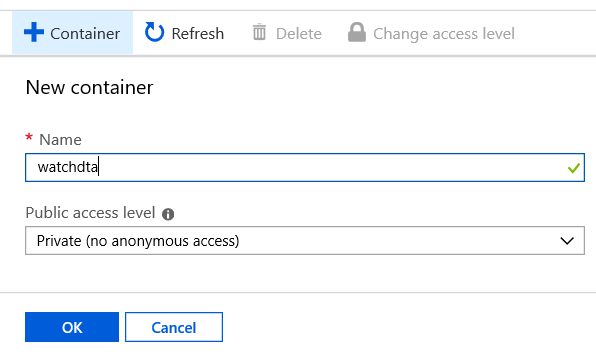

## Event Hubs

Create a new Event Hubs namespace and give it a unique name (for the demo use ConnectIQ<lastname> and put your name in there). Choose standard for the tier. Choose 1 in the throughput units. This is caable of ingesting 1MB of events, or 1000 events per second whichever comes first. As you can imagine, this is able to handle many devices so we are unlikely to hit these limits with this app. Click Create to create the namespace.

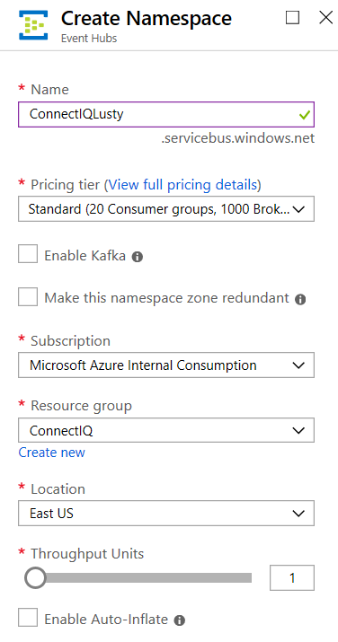

Once the namespace is created, open it in the console and click Firewalls and virtual networks then set the access to all networks. This is an IoT solution on which messages will be delivered from arbitary endpoints on the Internet so the firewall is not applicable. That's not to say the app is not secure. Connectivity is secured with encryption as well as shared access keys, so it's impossible to submit messages without this authentication and authorisation.


Click on Overview and add event hub. Name the event hub watchdata and set capture to on. Select the checkbox to avoid empty files being created when there is no data. Select your watchdata container in your storage account and then click Create.

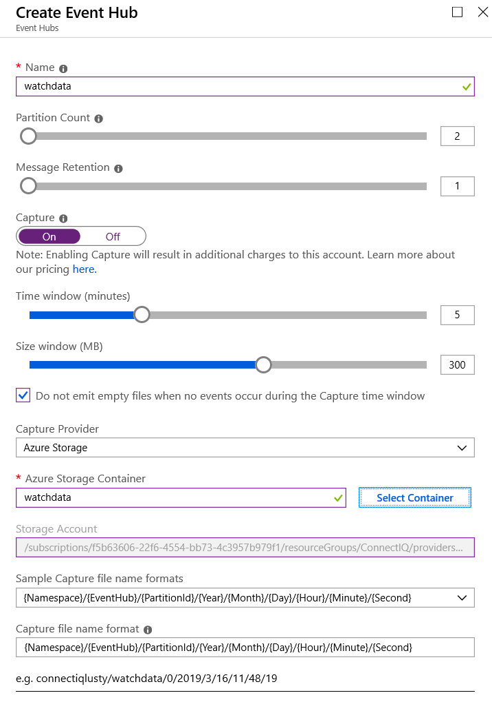

Click the watchdata event hub and then click Shared access policies. Click Add and create a policy with the name ConnectIQApp and Send permissions. This SAS policy will be used by all devices, but each device will have a specific token and publisher.

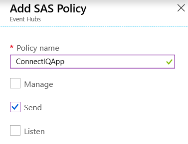

Once created, click on the policy to access the keys. Copy the primary key and paste it into the [Event Hubs Signature Generator](https://github.com/sandrinodimattia/RedDog/releases/tag/0.2.0.1) or use the instructions [from Microsoft](https://docs.microsoft.com/en-us/azure/event-hubs/event-hubs-authentication-and-security-model-overview) to create a SAS token for the device. Note that I've used the device serial number as publisher - you can use anything you like here but a serial number ensures each device is authenticated separately and also that the data is published to a dedicated location from each device. You may also choose to just enter "watch" or the model name here.

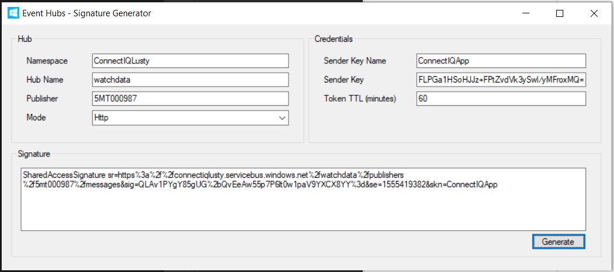

This will give us a message URI of `https//connectiqlusty.servicebus.windows.net/watchdata/publishers/5mt000987/messages` which we will enter into the source code of the app. Ensure you replace this with the one you generate, which will be `https//<YOURNamespace>.servicebus.windows.net/<YOUREventHub>/publishers/<YOURWatchSerial>/messages`.

## Create the App

Clone the repository to your local machine and open the IoTWatchEH project. Paste the URL from your Event Hub as above into the variable in the IoTWatchView.mc file. Also copy the shared access signature you generated with the tool and paste this in to the code. You can optionally change the timer variable from 5000 (5 seconds) to some other value. This is a balance of cost and battery life.

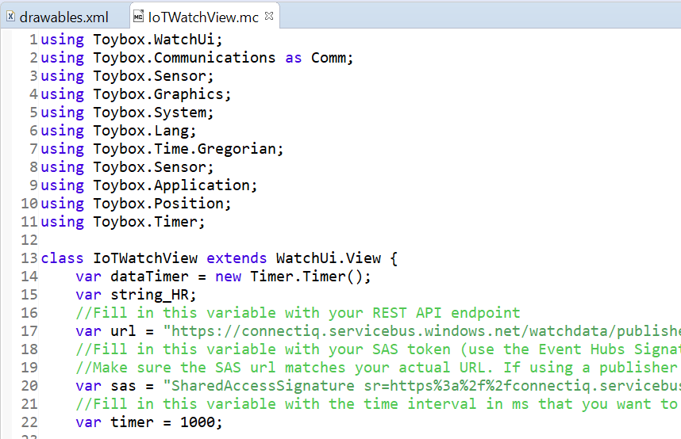

Run the app to test and you should see messages appear in your Event Hub monitor.

You can now side load the app to your device using the USB cable. Copy the file from the bin directory in your copy of the repository into the Apps directory on your device. You may need to restart the device to see the app. Start the app and ensure you have Bluetooth connectivity to the Connect mobile app and Internet access on your phone. You'll now see live data from the device arrive into your Event Hub.

## Power BI

Log in to [Powerbi.microsoft.com](https://powerbi.microsoft.com/en-us/) and create a new app workspace called ConnectIQ Demo. Stream Analytics will create the data set so for now this is all we need to do.

## Stream Analytics

Create a Stream Analytics job and name is ConnectIQ. Choose Cloud as the location and click Create.

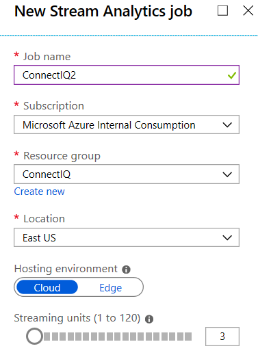

Click on Inputs and select Add Stream Input. Choose Event Hubs as the source.

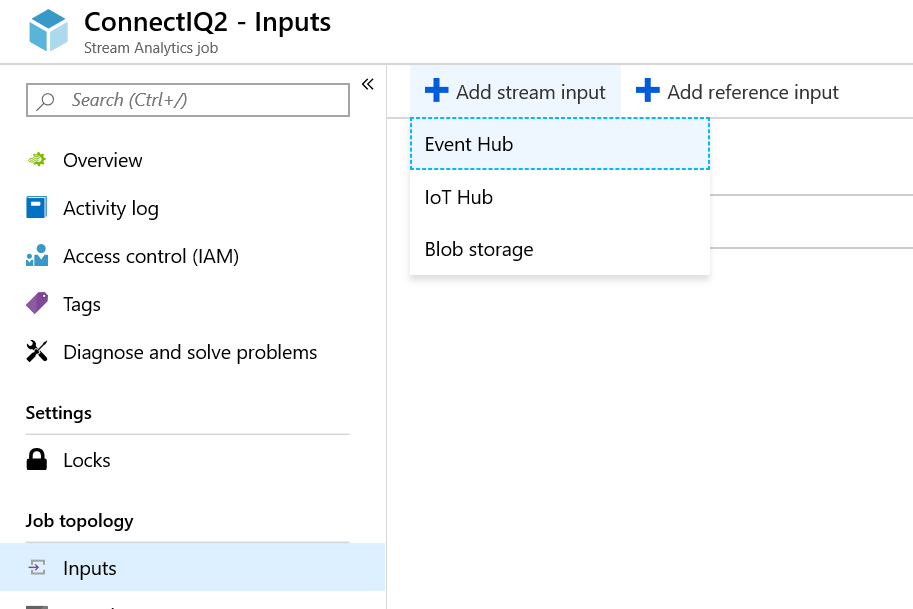

Fill in your event hub details and give the input a name.

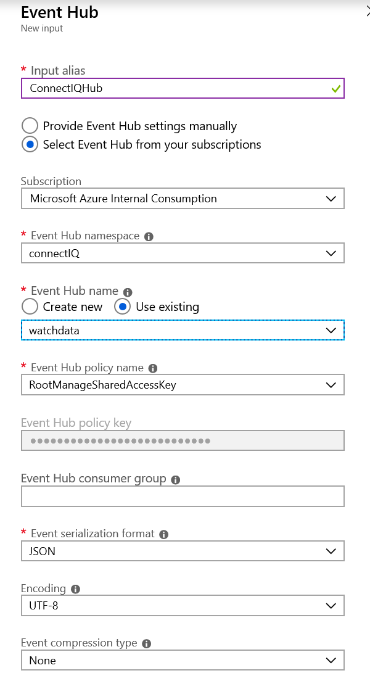

Next, click Outputs and select Add, then Power BI.

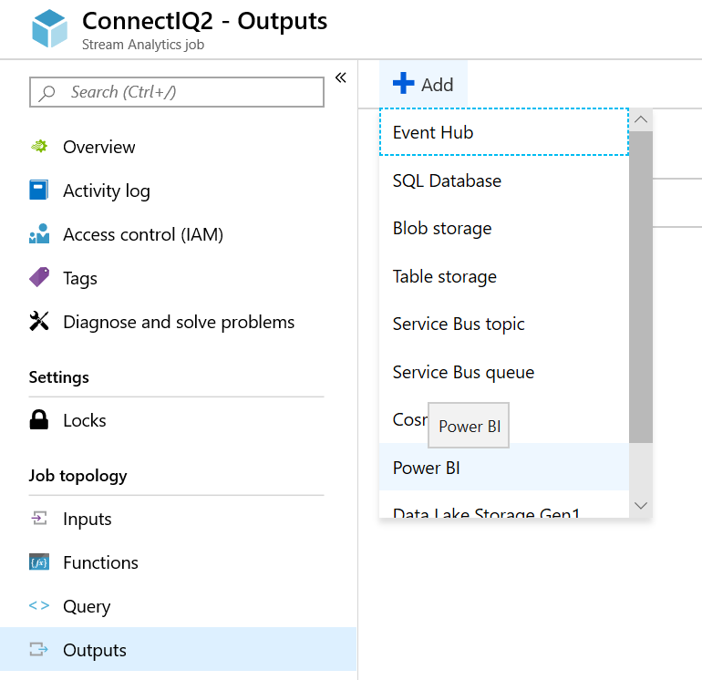

You'll need to authorise the app to connect to the Power BI service. This will then allow you to choose your app workspace and create a dataset in the service.

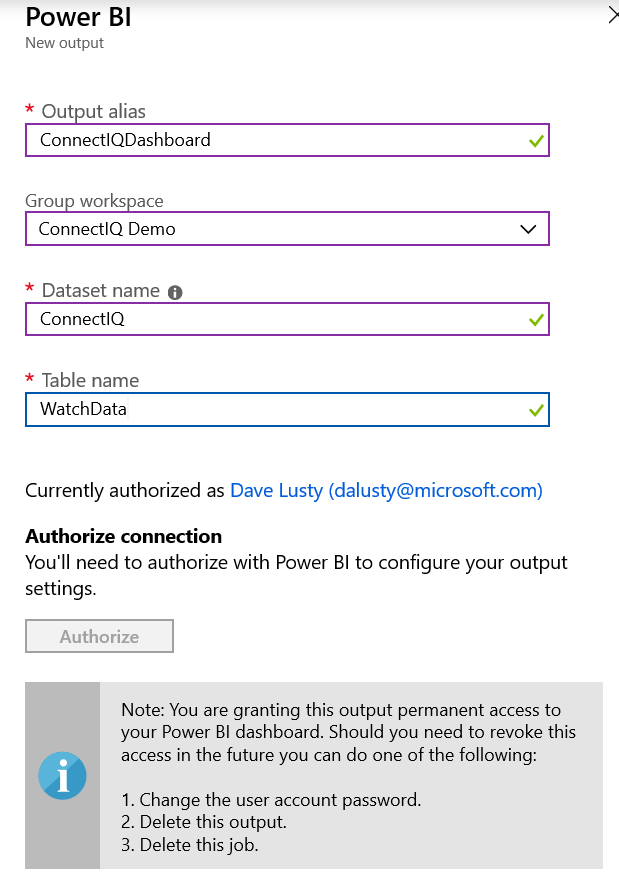

## Power BI Dashboard

Now create a dashboard and call it ConnectIQ Data. Add a tile and choose custom streaming data. Select your ConnectIQ dataset and then choose Card as the visualisation type. Select Heartrate as the field and click next. Add a title if you want one, and cilck apply to finish. Repeat this process to add a graph with timestamp as the axis and Heartrate as the value. Heartrate changes often so is a good metric to test with, but feel free to experiment.


If you now start the app you will see real time data on this dashboard.

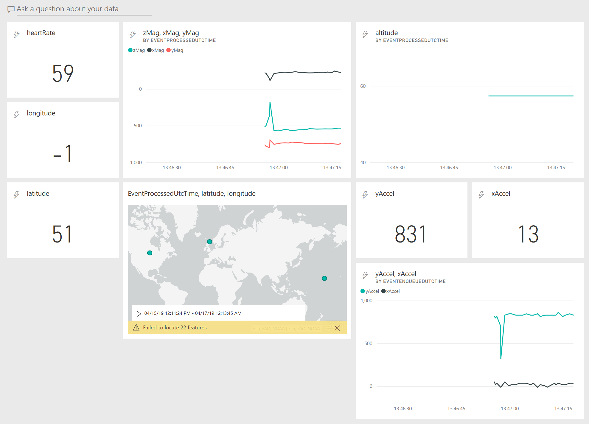

Note that at this point you will also see files begin to be created in your Blob storage, which we will later use for machine learning.