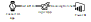
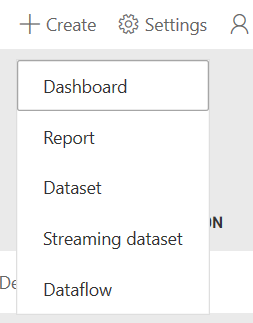
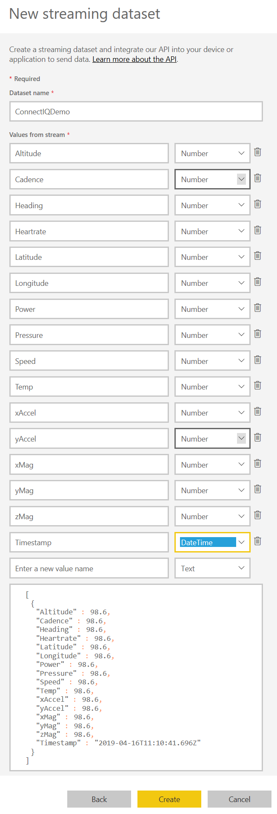
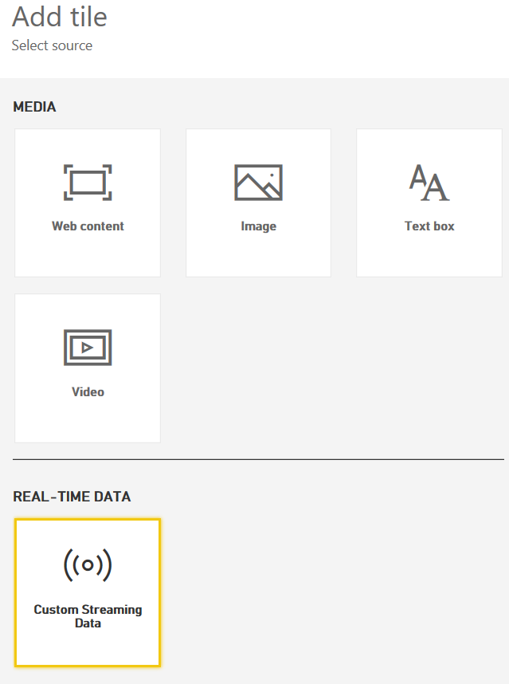
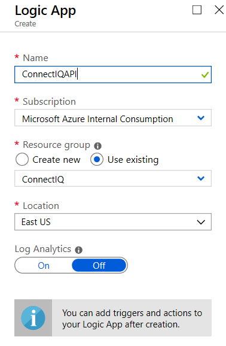
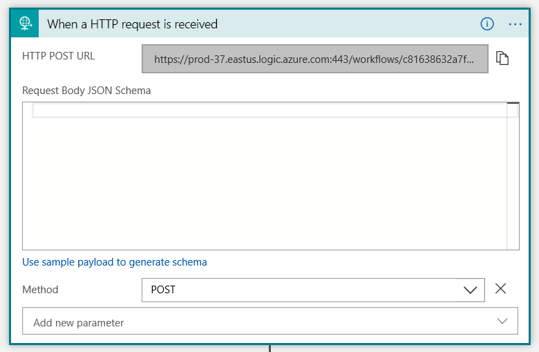
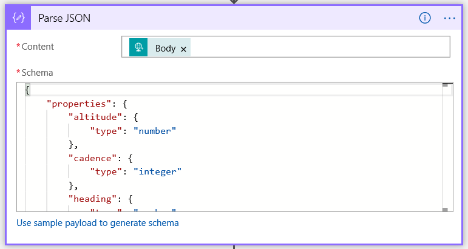
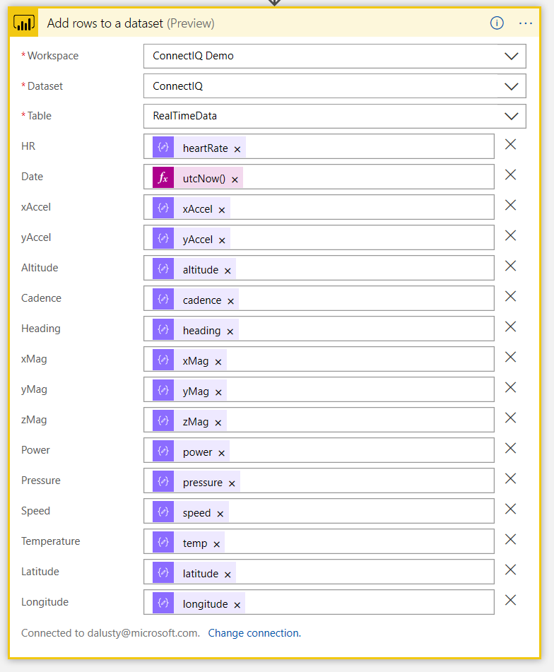
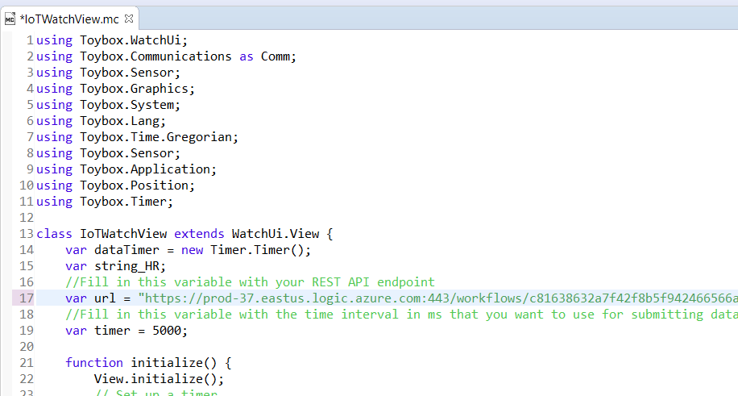
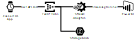

# Garmin Device Connect IQ IoT App
**produced by Dave Lusty**

## Introduction
This guide details how to configure the IoT watch app with Azure Services

## Prerequisites

Before getting started with this app you'll need to have a few things. Firstly you'll need a compatible (Garmin device)[https://developer.garmin.com/connect-iq/compatible-devices/]. Different devices have different capabilities so not all of them will be able to send all metrics.

Next, you'll need the Connect IQ SDK, the Eclipse IDE and the Java JRE installed. Instructions for setting these up can be found in the (Garmin getting started guide)[https://developer.garmin.com/connect-iq/programmers-guide/getting-started/].

# Environment 1



Of the two methods shown here, environment 1 is the simplest. This architecture uses a Logic App with HTTP endpoint to ingest data and push this to the Power BI streaming data service. This is simple to configure but not as scalable as the Event Hub version below.

## Power BI

Log in to [Powerbi.microsoft.com](https://powerbi.microsoft.com/en-us/) and create a new app workspace called ConnectIQ Demo. Once created, add a streaming dataset. Choose API and click Next.



Add in the various fields we'll be collecting. All of these are numbers except the timestamp which will be datetime. Enable historical data analysis so we can use the data later as well as in real time.



Now create a dashboard and call it ConnectIQ Data. Add a tile and choose custom streaming data. Select your ConnectIQ dataset and then choose Card as the visualisation type. Select Heartrate as the field and click next. Add a title if you want one, and cilck apply to finish. Repeat this process to add a graph with timestamp as the axis and Heartrate as the value. Heartrate changes often so is a good metric to test with, but feel free to experiment.



## Logic App

Create a Logic App in your subscription, call it ConnectIQAPI and choose a suitable location.



Once created, open the Logic App and add a trigger for HTTP request received. Set the method to POST and save your Logic App. This will fill in the URL which you'll need to copy into the source code of the ConnectIQ App.



Next, add a Parse JSON task and add in the body of the request as the content. In order to fill in the schema you may like to set up the app and receive a sample payload, for instance if you've modified the app in some way. For now, fill in the schema with the below:

```JSON
{
    "properties": {
        "altitude": {
            "type": "number"
        },
        "cadence": {
            "type": "integer"
        },
        "heading": {
            "type": "number"
        },
        "heartRate": {
            "type": "integer"
        },
        "latitude": {
            "type": "number"
        },
        "longitude": {
            "type": "number"
        },
        "power": {
            "type": "integer"
        },
        "pressure": {
            "type": "number"
        },
        "speed": {
            "type": "number"
        },
        "temp": {
            "type": "integer"
        },
        "xAccel": {
            "type": "integer"
        },
        "xMag": {
            "type": "integer"
        },
        "yAccel": {
            "type": "integer"
        },
        "yMag": {
            "type": "integer"
        },
        "zMag": {
            "type": "integer"
        }
    },
    "type": "object"
}
```



Finally, add a Power BI task to add rows to dataset. You'll need to authenticate to your Power BI account here, and then choose your app workspace and dataset. Add in the columns from the dataset and then use the variables from the Parse JSON task to fill them. Use utcnow() to add the timestamp.



## Create the App

CLone the repository to your local machine and open the IoTWatch2 project. Paste the URL from your Logic App HTTP trigger into the variable in the IoTWatchView.mc file. This includes the security token so is all you need to do. You can optionally change the timer variable from 5000 (5 seconds) to some other value. This is a balance of cost and battery life, remember your Logic App wil charge for each run.



Run the app to test and you should see data in your Logic App runs as well as being passed through to Power BI in near real time.

You can now side load the app to your device using the USB cable. Copy the file from the bin directory in your copy of the repository into the Apps directory on your device. You may need to restart the device to see the app. Start the app and ensure you have Bluetooth connectivity to the Connect mobile app and Internet access on your phone. You'll now see live data from the device in your Power BI session.

# Environment 2



This environment uses an Azure Event Hub to ingest messages. As such this would be much more scalable and allows for copying data to a data lake for later analytics. Stream Analytics then takes these events and pushed them on to Power BI for the demo environment.

## Storage Account

## Event Hubs

## Stream Analytics

## Power BI